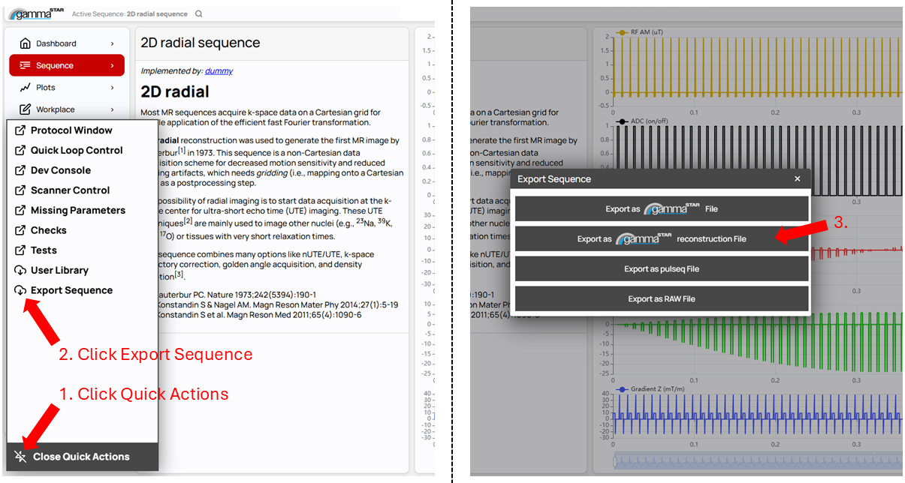

<div align="center">
  
</div>

# gammaSTAR Reconstructions v1.0.3 Release
A fully functional reconstruction server which is compatible with all gammaSTAR imaging sequences. 2D/3D Cartesian sequences are supported as well as 2D/3D non-Cartesian sequences. Examplary demonstration of usage in combination with tabletop systems, MR simulators and full body systems is demonstrated in
> Huber J, Hussain S, Kuhlen V, Neisser A, Schenk L, Konstandin S, Günther M, Klimenko M, Hoinkiss D. Introducing gammaSTAR Reconstructions: Demonstration of Vendor Neutral MR Data Acquisition and Reconstruction on Tabletop Systems, MR Simulators and 3T Systems. Proceedings of the 41st Annual Meeting of the ESMRMB.

## License
This software is distributed under the GNU Affero General Public License v3 (AGPL v3).  
A commercial license is also available for organizations or individuals requiring alternative licensing terms. For commercial licensing inquiries, please contact the [project maintainers](#contributors). A commercial license might also include additional features such as
- Joint estimation and correction of motion, geometric distortion and shifted fat signals in EPI-based experiments such as Arterial Spin Labeling or Diffusion-Weighted Imaging developed by Fraunhofer MEVIS
- Automatic quality control of acquired data developed by Fraunhofer MEVIS
- Patient adaptive solutions developed by Fraunhofer MEVIS
- Quality assured solutions which are compatible to the Open Recon interface by Siemens Healthineers
- Integration of your own algorithms into clinical workflows

## Prerequisites
1. Have python 3.12 installed. 
2. (Optional) Have [Docker Desktop](https://docs.docker.com/desktop/) or similar Docker variants installed for dockerized usage of gammaSTAR reconstructions. 
```bash
cd mrpy_tools/reconstruction
pip install ./mrpy_recon_tools
```

## Using gammaSTAR reconstructions without Docker
If Docker is not used, individual gammaSTAR modules have to be installed natively. Therefore, from the gammastar_recon repository, use the following commands to start the reconstruction server
```bash
pip install ./modules
python3 docker/main_gstar_recon.py
```

## Using gammaSTAR reconstructions with Docker (recommended)
The gammastar reconstruction docker image can be built using the following command from the gammastar_recon directory
```bash
docker build . --target=gstar_recon -t gstar_recon -f docker/Dockerfile
```
Alternatively, double-click the build_gammaSTAR_recon.bat file. <br>
Running the reconstruction server is as easy as the following:
```bash
docker run -p9002:9002 --rm -it gstar_recon
```
Alternatively, double-click the run_gammaSTAR_recon.bat file. 

## gammaSTAR Imaging Clients
We provide two types of imaging clients which can be used to send acquired raw data to the reconstruction servers. Clients are located in the clients folder. You need to install the mrpy_reconstruction_toolbox first in order to be able to use the following DICOM clients. 

### HDF5 Client
Data which is stored in mrd format (e.g., *.mrd, *.h5, *.h5f, from tabletop systems or simulation applications, which are connected to gammaSTAR) can be read and sent to the reconstruction using this client. Assuming an input dataset called input.h5, you can call the client using
```bash
cd clients
python3 mrd_to_dicom_client.py input.h5
```
Reconstructed images are catched by the client and stored in DICOM format to the same directory. 

### Siemens Twix Data Client
Data which is stored in twix format (e.g., *dat, from siemens VD/VE/VA systems) can be read and sent to the reconstruction using this client. Assuming an input dataset called input.dat, you can call the client using
```bash
cd clients
python3 twix_to_dicom_client.py input.dat
```
Note: The twix client requires an additional .json file which contains the gammaSTAR raw representations with the same name as the .dat file in the same directory! The json file can be created using the reconstruction file export from the gammaSTAR frontend. Make
sure to use the same protocol in the gammaSTAR frontend as used during the real MR measuremment on the Siemens MR system. 
<div align="center">
  
</div>

### Siemens Twix Data Conversion to HDF5
You can also create hdf5 files to be used with the HDF5 client from acquired siemens raw data using the twix_to_hdf5 client, which can be found in the utilities folder. The usage is identical to the siemens twix data client, e.g.
```bash
cd utilities
python3 twix_to_hdf5.py input.dat
```

## Unit Tests
The software comes with unit tests which validate the correct functionality of the underlying mrpy_recon_tools units. For execution you need to perform the following commands from the command line interface
```bash
pip install coverage
pip install -e mrpy_tools/reconstruction/mrpy_recon_tools # Installs mrpy_recon_tools as editable, which is needed for coverage generation
coverage run -m --source=. unittest discover -s mrpy_tools/reconstruction/mrpy_recon_tools/tests/unit_tests # Runs unit tests and tracks code coverage
coverage report # Displays code coverage in seperate units to the command line interface
coverage html # Creates report in html format
```

## Contributors
This project is maintained by [Jörn Huber](https://www.mevis.fraunhofer.de/en/employees/joern-huber.html)

Thanks to the following contributors for their valuable input:

- Tom Lütjen
- [Daniel Hoinkiss](https://www.mevis.fraunhofer.de/en/employees/daniel-hoinkiss.html) 
- Vincent Kuhlen
- Arne Neisser