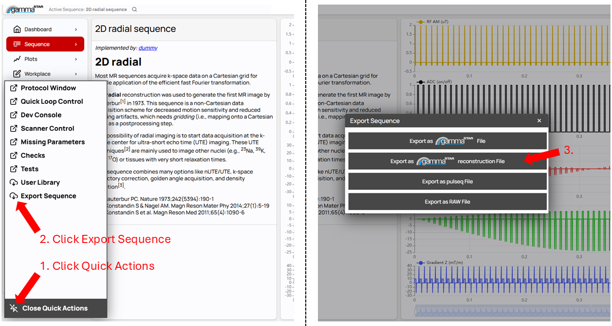

<div align="center">
  
</div>

# gammaSTAR Reconstructions v1.1.0 Release
A fully functional reconstruction server which is compatible with all gammaSTAR imaging sequences. 2D/3D Cartesian sequences are supported as well as 2D/3D non-Cartesian sequences. Examplary demonstration of usage in combination with tabletop systems, MR simulators and full body systems is demonstrated in
> Huber J, Hussain S, Kuhlen V, Neisser A, Schenk L, Konstandin S, Günther M, Klimenko M, Hoinkiss D. Introducing gammaSTAR Reconstructions: Demonstration of Vendor Neutral MR Data Acquisition and Reconstruction on Tabletop Systems, MR Simulators and 3T Systems. Proceedings of the 41st Annual Meeting of the ESMRMB.

## License
This software is distributed under the GNU Affero General Public License v3 (AGPL v3).  
A commercial license is available for organizations or individuals requiring alternative licensing terms. For commercial licensing inquiries, please contact the [project maintainers](#contributors). A commercial license can include additional features developed by Fraunhofer MEVIS such as
- Prospective and retrospective motion correction solutions
- Automatic quality control and analysis of acquired data
- Patient adaptive solutions for improved image quality
- Certified solutions (IEC 62304) which are compatible to the Open Recon interface by Siemens Healthineers
- Integration of your own reconstruction or processing algorithms into clinical workflows

## Prerequisites
1. Have python 3.12 installed. 
2. (Optional) Have [Docker Desktop](https://docs.docker.com/desktop/) or similar Docker variants installed for dockerized usage of gammaSTAR reconstructions. 
3. Install mrpy_recon_tools as this is needed for usage of the client software. Therefore from a terminal within the gammastar_recon repository type
```bash
pip install ./mrpy_tools/reconstruction/mrpy_recon_tools
```

## Using gammaSTAR Reconstructions without Docker
If Docker is not used, individual gammaSTAR modules have to be installed natively. The needed core units for reconstruction tasks have already been installed during the [Prerequisites](#prerequisites) step. Now we need to install individual modules, which bundle the core units to perform specific tasks during image reconstruction (e.g. coil combination)
```bash
pip install ./modules
```
Now, you can the run reconstruction server using
```bash
python3 docker/main_gs-recon.py
```

## Using gammaSTAR Reconstructions with Docker
The gammastar reconstruction docker image can be built using the following command from the gammastar_recon directory
```bash
docker build . --target=gs-recon -t gs-recon -f docker/Dockerfile
```
Alternatively, double-click the `build_gs-recon.bat` file. <br>
Running the reconstruction server is as easy as:
```bash
docker run -p9002:9002 --rm -it gs-recon
```
Alternatively, double-click the `run_gs-recon.bat` file.

## gammaSTAR Client
This software comes with a client software, which allows to send raw twix data (Siemens MRI systems) or hdf5 data (e.g. from MRZero) to the reconstruction server. It also provides to option to operate in Open Sequence streaming mode. The client is located in the [`clients`](clients/) folder. Usage is as follows and for more details see the readme in the mentioned folder. 
```sh
python gs-client.py <filepath> [options]
```
The twix mode requires an additional .json file which contains the gammaSTAR raw representations and header information with the same name as the .dat file in the same directory! The json file can be created using the reconstruction file export from the gammaSTAR frontend. Make
sure to use the same protocol in the gammaSTAR frontend as used during the real MR measuremment on the Siemens MR system. 
<div align="center">
  
</div>

## Unit Tests
The software comes with unit tests which validate the correct functionality of the underlying mrpy_recon_tools units. For execution you need to perform the following commands from the command line interface
```bash
pip install coverage
pip install -e mrpy_tools/reconstruction/mrpy_recon_tools
coverage run -m --source=. unittest discover -s mrpy_tools/reconstruction/mrpy_recon_tools/tests/unit_tests
coverage report
```
The code coverage can be found [`here`](mrpy_tools/reconstruction/mrpy_recon_tools/tests/coverage.txt).

## Contributors
This project is maintained by [Jörn Huber](https://www.mevis.fraunhofer.de/en/employees/joern-huber.html)

Thanks to the following contributors for their valuable input:

- Tom Lütjen
- [Daniel Hoinkiss](https://www.mevis.fraunhofer.de/en/employees/daniel-hoinkiss.html) 
- Vincent Kuhlen
- Arne Neisser